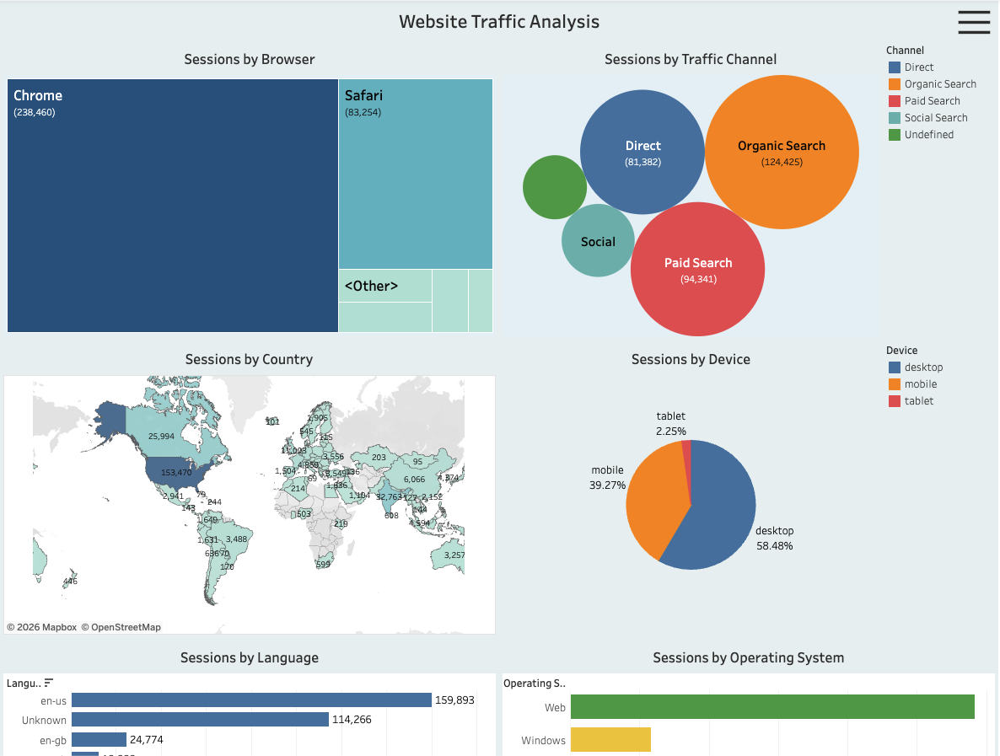

# Website Traffic Analysis Dashboard
Tableau dashboard analyzing website traffic, user devices, browsers, and traffic channels.

## Dashboard Preview

## Business Task
Analyze website traffic data to understand user behavior, traffic sources, and session distribution across countries, devices, and browsers.

## Tools
Tableau, Data Visualization, Dashboard Design, KPI Analysis 

## Key Insights
- Most sessions come from desktop devices, followed by mobile.
- Organic Search and Direct are the main traffic channels.
- Chrome generates the highest number of sessions among browsers.
- The Americas generate the largest share of website traffic.
- Website sessions change over time with several peaks.
  
## Interactive Dashboard
[View the interactive dashboard on Tableau Public](https://public.tableau.com/shared/KZZRGBDGH?:display_count=n&:origin=viz_share_link)
